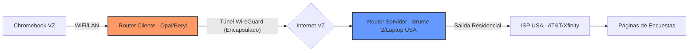

# Sistema de Túnel Residencial de Hardware (GL.iNet)

Este sistema establece un puente de red físico entre Venezuela (VZ) y Estados Unidos (USA), permitiendo que cualquier dispositivo en la red local de VZ navegue con una identidad residencial estadounidense pura, eliminando las latencias de video y las detecciones de software de escritorio remoto.

## 1. Arquitectura del Sistema

El núcleo del sistema es el uso de dos routers **GL.iNet** que establecen un túnel mediante el protocolo **WireGuard**.

### Componentes Clave:
* **Servidor (USA):** Dispositivo físico conectado al modem del familiar. Actúa como el "punto de salida" real.
* **Cliente (VZ):** Router que gestiona la conexión en tu hogar. Cifra el tráfico antes de que salga de Venezuela.
* **Protocolo WireGuard:** Elegido por su alta velocidad y bajo consumo de recursos en comparación con OpenVPN.

---

## 2. Configuración del Servidor (USA)

Si utilizas un dispositivo GL.iNet (como el Brume 2) o la laptop con Bitvise/WireGuard Server:

### Pasos en la interfaz GL.iNet:
1.  **VPN Server -> WireGuard:** Activar el servidor.
2.  **Puerto:** Por defecto utiliza el `51820` (UDP). 
3.  **Configuración de Clientes:** Generar un perfil (archivo `.conf` o Código QR) para el router en Venezuela.
4.  **DDNS:** Activar el servicio de GL.iNet DDNS para que el router de VZ siempre encuentre al de USA aunque la IP pública cambie.

> [!WARNING] Port Forwarding
> Es obligatorio entrar a la configuración del módem principal del familiar (ej. 192.168.1.1) y redirigir el puerto UDP 51820 hacia la IP local del servidor GL.iNet. Sin esto, el túnel no podrá establecerse.

---

## 3. Configuración del Cliente (VZ)

En tu router local (Opal/Beryl), importa el perfil generado en el paso anterior.

### Ajustes Críticos de Seguridad:
* **Global Proxy:** Asegúrate de que el modo esté en "Global" para que todo el tráfico pase por USA.
* **VPN Dashboard -> Options:**
    * **Allow Access Local Network:** Desactivado (para evitar fugas de IP local).
    * **Services from Vendor:** Desactivado.
* **DNS Settings:** * Modo: **Manual**.
    * DNS: Utilizar `1.1.1.1` o `9.9.9.9`.
    * Activar **DNS Rebinding Attack Protection**.

> [!DANGER] El "Kill Switch" de Hardware
> Activa la opción **"Block Non-VPN Traffic"**. Si el internet en Ciudad Ojeda falla o el túnel cae, el router cortará el acceso a internet inmediatamente. Tu Chromebook nunca expondrá la IP de Venezuela a los servidores de Branded Surveys o Valued Opinions.

---

## 4. Integración con el Workflow de Trabajo

Este sistema de red es la base sobre la que se asientan tus otras herramientas:

### Capa 1: El Número (Tello)
* Utiliza el **Wi-Fi Calling** de tu teléfono conectado al WiFi del router GL.iNet.
* Esto permite recibir los SMS de verificación de las páginas de encuestas sin costo de Roaming y con una señal "local" de USA.

### Capa 2: La Huella Digital (Dolphin Anty)
Aunque el router da la IP, el navegador puede dar datos del hardware.
1.  **WebRTC:** Configúralo en Dolphin como **"Real"**. Al estar tras el router, el WebRTC detectará la IP privada del router y la IP pública de USA, lo cual es el comportamiento natural de un usuario real.
2.  **Timezone:** Configura Dolphin para que coincida con la zona horaria del servidor en USA (ej. EST/PST).
3.  **Geolocation:** Ponlo en "Prompt" o "Block", nunca permitas que use la API de Google Maps del Chromebook.

---

## 5. Ventajas sobre Escritorio Remoto (AnyDesk/Chrome)

| Característica | Escritorio Remoto | Sistema Mini Router |
| :--- | :--- | :--- |
| **Detección** | Alta (Procesos e inyección de JS) | Casi Nula (Invisible para el OS) |
| **Latencia** | Depende del streaming de video | Mínima (Solo datos en bruto) |
| **Estabilidad** | Se cierra si la PC de USA se apaga | Reconexión automática persistente |
| **Multicuenta** | Difícil de gestionar | Fácil (Dolphin maneja perfiles) |

---

## 6. Mantenimiento y Monitoreo

Para asegurar la continuidad operativa en Venezuela:
1.  **UPS/Respaldo:** El router de VZ consume solo 5V/2A. Puede ser alimentado por un Powerbank estándar durante apagones para mantener el túnel vivo si tienes internet (Fibra/WISP).
2.  **Tailscale:** Si no puedes hacer Port Forwarding en USA, instala el plugin de Tailscale en ambos routers. Creará un túnel "punto a punto" saltando el firewall del ISP de forma transparente.

## 7. Optimización de Dolphin Anty para el Puente GL.iNet

Al usar un router físico, la configuración de Dolphin Anty cambia radicalmente. Ya no necesitas "engañar" al navegador sobre tu IP, sino permitir que lea la red real que el router está proyectando.

### Configuración del Perfil (Fingerprint)
* **Proxy:** Selecciona **"No Proxy"**. 
    * *Razón:* El router ya está enviando todo el tráfico por el túnel. Si pones un proxy en Dolphin, estarás haciendo "Double Proxying", lo cual aumenta la latencia y es un patrón sospechoso para sitios como *Branded Surveys*.
* **WebRTC:** Cámbialo a **"Real"** (o "Automatic").
    * Al estar conectado al router GL.iNet, el navegador detectará la IP local del router (ej. 192.168.8.1) y la IP pública de USA. Esto es exactamente lo que vería un usuario real en su casa en EE. UU.
* **Timezone:** Activa **"Fill based on IP"**.
    * Esto sincronizará la hora del navegador con la ubicación del servidor en USA de forma automática.
* **Geolocation:** Configúralo en **"Allow"** y selecciona **"Prompt"**. 
    * Asegúrate de que las coordenadas coincidan con la ciudad donde reside tu familiar. Puedes obtenerlas en sitios como `iplocation.net`.

---

## 8. Gestión de Identidad con Tello y Wi-Fi Calling

Para que el sistema sea 100% efectivo, la verificación telefónica debe ser transparente.

### Configuración de Tello en VZ:
1.  **Activar Wi-Fi Calling:** En los ajustes de tu smartphone (conectado al WiFi del router de USA), activa "Llamadas por Wi-Fi".
2.  **Dirección de Emergencia (E911):** Tello te pedirá una dirección física en USA para activar esta función. Usa la dirección de tu familiar.
3.  **Resultado:** Tu teléfono mostrará "Tello Wi-Fi" en la barra de estado. Podrás recibir los SMS de validación de *Valued Opinions* o *Branded* sin latencia y de forma gratuita, ya que el sistema detecta que estás llamando/mensajeando "desde USA" a través de internet.

---

## 9. Protocolo de Verificación de "Salud" de Conexión

Antes de iniciar sesión en cualquier plataforma de encuestas, realiza este chequeo rápido para evitar baneos por fugas accidentales:

1.  **Whoer.net:** Verifica que el puntaje sea **100/100**.
2.  **Pixelscan.net:** Comprueba que el hardware fingerprint sea consistente y que no se detecte "Navegador inconsistente".
3.  **IP Quality Score:** Pasa un test de "Fraud Score". Si el puntaje es mayor a 20, reinicia el router en USA para intentar obtener una IP residencial dinámica diferente.

---

## 10. Resolución de Problemas (Troubleshooting)

### El túnel no conecta (Handshake fallido)
* **Causa:** El ISP de USA bloqueó el puerto o la IP pública cambió.
* **Solución:** Verifica que el DDNS de GL.iNet esté activo. Si persiste, cambia el puerto de WireGuard de `51820` a uno común como `443` (aunque sea TCP/UDP mix, a veces ayuda a saltar bloqueos).

### Velocidad extremadamente lenta
* **Causa:** Saturación del protocolo o MTU incorrecto.
* **Solución:** Ajusta el **MTU** en la configuración de WireGuard del router cliente a `1280` o `1320`. Esto evita la fragmentación de paquetes en conexiones de internet inestables como las de Venezuela.

### Detección de "Proxy/VPN" en la página
* **Causa:** La IP de tu familiar ha sido marcada por uso excesivo o pertenece a un rango de ISP menor.
* **Solución:** Activa la función **"AdGuard Home"** integrada en el router GL.iNet para bloquear rastreadores de telemetría que intentan identificar herramientas de red.

---

## 11. Workflow Diario Recomendado

1.  Encender Router Cliente en Venezuela.
2.  Verificar conexión del túnel (Luz LED del router o panel de control).
3.  Conectar Chromebook al WiFi "USA_RESIDENTIAL".
4.  Abrir Dolphin Anty y ejecutar el perfil específico de la encuesta.
5.  Mantener el smartphone con Tello a mano para códigos 2FA.
6.  Al terminar, cerrar Dolphin y desconectar el WiFi en el Chromebook para evitar fugas de telemetría de Google en segundo plano.
