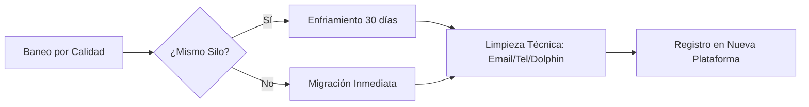

# Estrategia de Operaciones: Gestión de Identidad y Silos de Encuestas

Esta documentación define el flujo de trabajo para la operación de encuestas desde Venezuela hacia EE. UU., optimizando el uso de hardware residencial en el punto de salida y la gestión de identidades tras baneos por calidad.

---

## 1. Infraestructura de Red: Salida Residencial en USA

La arquitectura se basa en el redireccionamiento de tráfico desde el cliente (Dolphin Anty en VZ) hacia un nodo físico en USA que garantiza una IP residencial auténtica.

### Configuración del Lado USA (Punto de Salida)
Dependiendo de la carga de trabajo en la ubicación remota, se utilizan dos tipos de dispositivos GL.iNet actuando como servidores VPN/Proxy:

* **Opal (GL-SFT1200):** Utilizado en locaciones con una sola cuenta activa. Es un router de viaje económico pero suficiente para un flujo de datos individual.
* **Brume 2 (GL-MT2500):** Utilizado en locaciones que gestionan 2 o más cuentas simultáneas. Su procesador de alto rendimiento permite múltiples túneles cifrados sin degradación de velocidad.

### Configuración del Lado Venezuela (Punto de Trabajo)
* **Herramienta:** **Dolphin Anty**.
* **Método:** Se utiliza el gestor de proxies nativo de Dolphin para conectar directamente al servidor configurado en el router de USA (vía SOCKS5 o HTTP con autenticación).
* **Ventaja:** Elimina la necesidad de hardware adicional en Venezuela, permitiendo que el Chromebook gestione la identidad directamente desde el navegador.

---

## 2. Mapa de Silos de Routers (Proveedores de Datos)

El baneo por "calidad" suele ocurrir a nivel de **Router de Encuestas**. Estos proveedores alimentan a múltiples páginas. Si eres baneado en una página, tu identidad puede estar "marcada" en todas las demás páginas que usen el mismo proveedor.

| Silo | Proveedor Dominante | Plataformas Asociadas | Nivel de Riesgo Tras Baneo |
| :--- | :--- | :--- | :--- |
| **Silo 1** | **Dynata** | Valued Opinions, Opinion Outpost, QuickThoughts. | **Crítico:** Comparten base de datos de calidad en tiempo real. |
| **Silo 2** | **Cint / Lucid** | Prime Opinion, Branded Surveys, Survey Junkie, Five Surveys, KashKick. | **Alto:** Es el "Marketplace" más grande. Un baneo por calidad aquí afecta el acceso a miles de encuestas. |
| **Silo 3** | **Prodege** | Swagbucks, InboxDollars, MyPoints, Upromise. | **Medio:** Tienen sus propios criterios, pero cruzan datos de fraude básicos. |
| **Silo 4** | **Kantar/Profiles** | LifePoints, Toluna Influencers. | **Bajo:** Suelen ser más independientes en su gestión de calidad. |

---

## 3. Protocolo de Enfriamiento de Identidad (Identity Cooling)

El "enfriamiento" es un periodo de inactividad estratégica necesario cuando una identidad ha sido marcada por baja calidad pero no por fraude de identidad.

### Mecánica del Enfriamiento
* **Duración:** 15 a 30 días.
* **Objetivo:** Permitir que los registros temporales (*Session Hashes*) en los servidores de los proveedores de encuestas expiren o sean movidos a archivos históricos menos activos.
* **Proceso Técnico:**
    1.  Eliminar el perfil de Dolphin Anty asociado.
    2.  Cerrar cualquier sesión activa en el número de Tello.
    3.  **No intentar registros** con esa identidad durante este periodo; cada intento fallido resetea el contador de enfriamiento en el servidor del router.

---

## 4. Estrategia de Migración Post-Baneo (Cosecha Secuencial)

Tras un baneo por calidad en la Plataforma A, la Identidad 1 debe ser "reempaquetada" antes de ingresar a la Plataforma B.

### Pasos de Descontaminación:
1.  **Cambio de Silo:** Si fuiste baneado en un sitio de Dynata, migra la identidad a un sitio de Cint o Prodege. Evita saltar entre páginas del mismo dueño inmediatamente.
2.  **Variación de Datos Blandos:**
    * **Correo:** Crear uno nuevo en un proveedor distinto (ej. de Gmail a Outlook).
    * **Teléfono:** Adquirir un nuevo número en **Tello**. Es el vínculo más fuerte entre cuentas.
    * **Dirección:** Alterar la redacción (ej. "Apt 4B" -> "Unit 4-B").
3.  **Nuevo Perfil de Hardware:** En Dolphin Anty, generar un perfil con un **Fingerprint** de hardware distinto. Cambia la CPU (ej. de 4 a 8 núcleos) y la RAM emulada para que el "Device ID" sea nuevo.
4.  **Ajuste de Comportamiento:** El baneo por calidad es una alerta conductual. En la nueva plataforma, se debe aumentar el tiempo de permanencia en cada pregunta y evitar respuestas contradictorias en las preguntas de control.

---

## 5. Recomendaciones de Seguridad Operativa

> [!TIP] Consistencia Demográfica
> Aunque cambies de plataforma, mantén la Fecha de Nacimiento y el Código Postal idénticos a los del documento real. Cualquier variación aquí disparará una alerta de fraude de identidad, la cual es mucho más difícil de recuperar que un baneo por calidad.

> [!WARNING] Uso de IP
> Si utilizas el **Brume 2** para múltiples cuentas, asegúrate de que cada perfil de Dolphin tenga asignado un puerto de proxy diferente si estás usando múltiples instancias de servidor, para evitar que dos identidades compartan la misma sesión de navegación simultáneamente.
