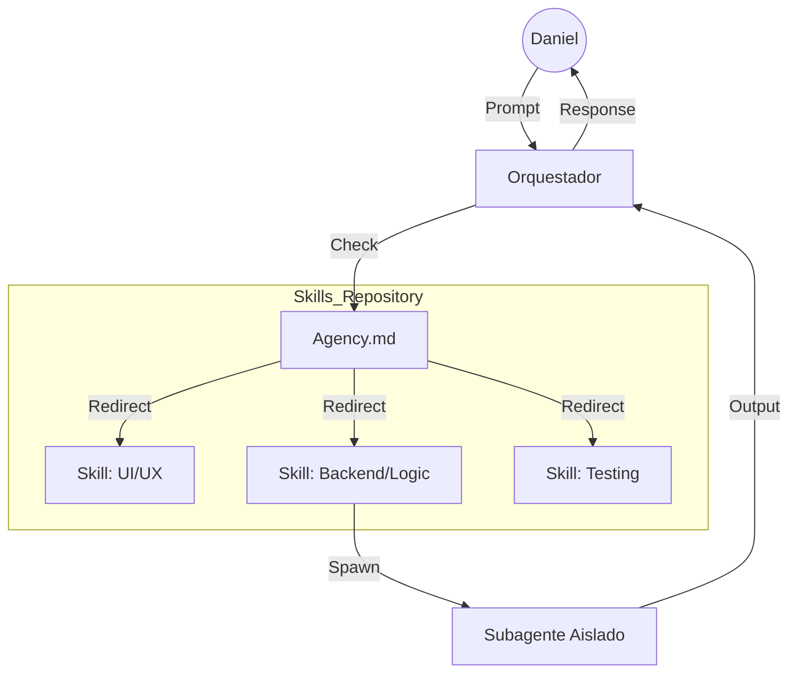

# [El Sistema de Skills que Cambió Cómo Trabajo con IA (Curso Completo) / Gentleman Programming]

## Sinopsis y Alcance
En este video, Alan Buscaglia presenta una arquitectura avanzada para trabajar con agentes de IA y LLMs dentro de entornos de desarrollo profesionales. El objetivo es optimizar la interacción con la IA mediante la reducción de la "alucinación" y el exceso de contexto, utilizando una estructura de archivos `Agency.md`, un sistema de *Skills* (habilidades) personalizadas y la implementación de agentes orquestadores con subagentes independientes.

## Desarrollo de Contenidos (Hechos y Teoría)

### [Arquitectura de Agentes y Agency.md]
* **Agency.md**: Es un archivo de tipo *markdown* diseñado específicamente para ser consumido por agentes de IA (a diferencia del README.md, que es para humanos). Actúa como la "fuente de la verdad" sobre la cultura, arquitectura y estándares del proyecto [00:01:21].
* **Gestión del Contexto**: Un exceso de contexto provoca alucinaciones en los modelos. Se recomienda que los archivos de contexto tengan entre *250 y 500 líneas* máximo [00:04:32].
* **Estructura Jerárquica**: En proyectos grandes o monorepos, se utiliza un `Agency.md` raíz (*Root*) que redirige al agente hacia archivos específicos en carpetas de *UI*, *API* o *Autenticación* según la necesidad [00:06:23].

### [El Sistema de Skills (Habilidades)]
* **Definición de Skill**: Son archivos `.md` que contienen metadatos y directrices específicas para tareas concretas (ej. crear componentes de React, scripts de Python, manejo de Pull Requests o Commits) [00:07:20].
* **Metadatos de una Skill**: Incluyen el *Nombre*, *Descripción*, *Trigger* (activador semántico), *Licencia*, *Versión*, *Scope* (ámbito de aplicación) y *Tools* (herramientas permitidas como bash, read, write) [00:16:09].
* **Autoinvocación**: Para asegurar que el agente use la skill adecuada, se deben incluir instrucciones explícitas en el `Agency.md` que obliguen al agente a consultar el archivo de la skill ante ciertas acciones [00:15:05].

### [Agentes Orquestadores y Subagentes]
* **Rol del Orquestador**: El agente principal actúa como un director que delega tareas complejas o repetitivas a subagentes [00:11:14].
* **Independencia de Contexto**: Cada subagente trabaja en su propio "hilo" o burbuja de contexto. Al finalizar, solo entrega un *resumen* de lo realizado al orquestador, manteniendo el contexto principal limpio y eficiente [00:12:10].

## Perspectiva del Autor (Opiniones e Interpretación)
* Alan enfatiza que esta arquitectura es un **"invento" propio** nacido de la experimentación, ya que la tecnología progresa más rápido que las convenciones oficiales [00:00:21].
* Critica la idea de que "más contexto es mejor", argumentando que la eficiencia de la IA reside en darle solo la información necesaria en el momento preciso [00:05:02].
* Menciona que, aunque herramientas como Claude o Gemini dicen manejar skills automáticamente, en la práctica suelen tomarlas solo como sugerencias, por lo que su método de "obligar" la autoinvocación es más robusto [00:09:48].

## Referencias y Evidencia
* **Proyecto de Referencia**: *Prowler Cloud* (herramienta Open Source de ciberseguridad en la nube), donde se aplica esta arquitectura para guiar a contribuyentes externos [00:02:16].
* **Herramientas mencionadas**: *Open Code*, *Claude*, *Gemini*, *GPT*, *GitHub Copilot* y *Cursor* (implícito en el flujo de trabajo).
* **Scripts de Automatización**: El autor utiliza scripts `setup.sh` para crear *links simbólicos* y sincronizar las skills entre diferentes agentes [00:19:14].

## Síntesis Crítica
La propuesta es altamente sólida para flujos de trabajo profesionales (*Software Engineering* en lugar de solo *coding*). La limitación principal es que requiere un mantenimiento manual inicial para configurar los archivos `.md` y los scripts de sincronización, aunque el autor lo mitiga creando una "Skill para crear Skills" [00:21:31]. Es una solución ideal para equipos *Open Source* o equipos con estándares de arquitectura muy estrictos (como SOLID y Pydantic, mencionados en tu perfil).

### [Concepto C] Flujo de Trabajo y Automatización
* **Inyección de Skills**: El autor utiliza una técnica de *Symbolic Links* (enlaces simbólicos) para centralizar sus habilidades personales en un solo repositorio y "conectarlas" a múltiples proyectos locales sin duplicar archivos [00:19:35].
* **El Ciclo de Vida**: 
    1. El usuario lanza una petición general.
    2. El Orquestador consulta `Agency.md`.
    3. `Agency.md` redirige a la *Skill* específica según el *Scope*.
    4. El Subagente ejecuta la tarea bajo las reglas de la *Skill*.
    5. Se devuelve un resultado limpio al flujo principal [00:13:20].

### [Concepto D] Gestión de Identidad y Cultura
* **Estandarización de Salida**: Las *Skills* no solo definen código, sino también el formato de comunicación (ej. "Habla siempre en español", "No pidas confirmación para cambios menores").
* **Cultura de Proyecto**: El archivo `Agency.md` debe incluir el "Stack Tecnológico" y los "Anti-patrones" prohibidos para evitar que la IA sugiera librerías obsoletas o arquitecturas no deseadas [00:03:45].

## Perspectiva del Autor (Opiniones e Interpretación)
* Alan sostiene que el futuro del desarrollo no es "pedirle cosas a la IA", sino construir un sistema de agentes que entienda el contexto empresarial y técnico de forma autónoma.
* Considera que el uso de *Prompts* largos es una deuda técnica y que el "Prompt Engineering" debería evolucionar hacia la "Arquitectura de Agentes" [00:23:10].

## Referencias y Evidencia
* **Bibliografía técnica**: Menciona la importancia de seguir principios *SOLID* y *Clean Code* dentro de las definiciones de las skills para que la IA herede estas prácticas.
* **Repositorio**: Se menciona la existencia de un repositorio público de *Gentleman Programming* con ejemplos de estas plantillas de `Agency.md`.

## Síntesis Crítica
La metodología propuesta por Buscaglia resuelve el problema de la "deriva de contexto" en proyectos de larga duración. Es especialmente valioso para perfiles *Senior* o *High Junior* (como tú, Daniel), ya que permite delegar el "trabajo sucio" (boilerplate, scripts de migración) asegurando que la IA no rompa las reglas de arquitectura establecidas en el proyecto. La mayor fortaleza es la escalabilidad: el sistema crece con el proyecto sin degradar la precisión del modelo.

# [Arquitectura de Agentes y Sistema de Skills / Gentleman Programming]

## Sinopsis y Alcance
Desglose técnico de la arquitectura de orquestación de IA propuesta por Alan Buscaglia. Se centra en el desacoplamiento de responsabilidades mediante un archivo maestro de identidad y módulos de habilidades (*Skills*) independientes.

## Desarrollo de Contenidos (Hechos y Teoría)

### [Estructura del Ecosistema de Agentes]
* **Agente Orquestador**: Actúa como el *Main Entry Point*. Su única responsabilidad es entender la intención del usuario y delegar.
* **Archivo Agency.md**: El *Global Context Buffer*. Contiene la arquitectura del proyecto, reglas de negocio y el índice de habilidades.
* **Subagentes**: Instancias de ejecución con *Contexto Volátil*. Se destruyen tras completar la tarea, devolviendo solo el output final.




### [Definición Técnica de una Skill]
* Una *Skill* es un contrato de ejecución. Debe incluir *Triggers* semánticos para que el Orquestador sepa cuándo activarla.
* **Estructura de metadatos**:
    * *Name*: Identificador único.
    * *Description*: Para qué sirve.
    * *Tools*: Permisos de lectura/escritura en el sistema de archivos.

```markdown
# Skill: Create_Pydantic_Model
## Metadata
- Trigger: "crear modelo", "nuevo esquema de datos"
- Scope: /src/schemas
- Tools: [filesystem_write, shell_execution]

## Rules
- Use Pydantic V2.
- Strict Type Hinting mandatory.
- All fields must have Description.
```

## Perspectiva del Autor (Opiniones e Interpretación)
* El autor sostiene que el *Prompt Engineering* tradicional es ineficiente para proyectos grandes. La clave está en la **Arquitectura de Contexto**.
* Opina que delegar en subagentes previene la "corrupción de la memoria" del chat principal, manteniendo la coherencia en sesiones largas de trabajo.

## Referencias y Evidencia
* Implementación práctica mediante *Symlinks* para compartir la carpeta `.skills` entre diferentes repositorios de Git.
* Referencia a la "Capa de Abstracción de Instrucciones" para que el sistema sea agnóstico al modelo (Claude, GPT-4, etc.).

## Síntesis Crítica
El sistema es extremadamente compatible con tu metodología de **Micro-pasos**, Daniel. Al fragmentar las capacidades de la IA en archivos `.md` individuales, reduces drásticamente la alucinación y aseguras que cada "micro-paso" se ejecute bajo los estándares de tu *Directiva Maestra*.


