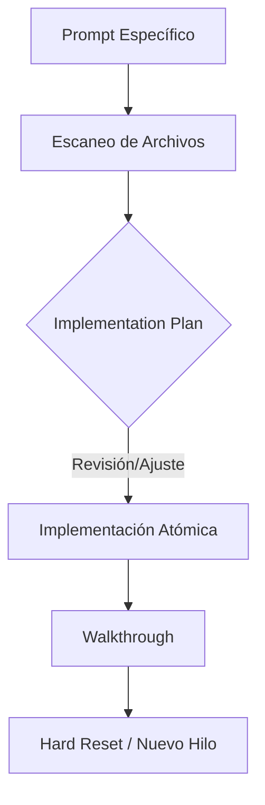

# Optimización de Agentes en Google Antigravity

> [!ABSTRACT] Resumen
> Guía técnica para el desarrollo asistido por agentes en entornos "agent-first". Se enfoca en la gestión de la atomicidad, la higiene del contexto y la orquestación estratégica de modelos.

## 1. El Workflow de Alta Precisión
El flujo de trabajo actual de 5 pasos es robusto, pero su éxito depende de la **gestión de la atención** del agente.

### Diagrama de Flujo Sugerido


## 2. Orquestación de Modelos (Brain vs. Brawn)
No todos los modelos son iguales para cada fase del proceso. La combinación de **Claude** para la lógica y **Gemini** para el contexto masivo es la estrategia ganadora.

| Fase | Modelo Sugerido | Razón Técnica |
| :--- | :--- | :--- |
| **Escaneo / Contexto** | Gemini 3 Pro High | Capacidad para procesar repositorios enteros en su ventana de contexto. |
| **Implementation Plan** | Claude 3.5 Sonnet | Lógica superior para prever efectos secundarios y dependencias. |
| **Ejecución (Fixes)** | Gemini / Claude | Gemini para tareas masivas (tests, refactor); Claude para algoritmos complejos. |
| **Walkthrough** | Cualquiera | Ambos modelos son competentes en síntesis de cambios. |

## 3. Estrategias de Optimización por Fase

### A. Refinamiento del Implementation Plan
> [!WARNING] El error del "OK" global
> Aceptar un plan de 10 puntos de una vez aumenta el riesgo de alucinaciones en los pasos finales debido a la pérdida de foco.

* **Táctica de Segmentación:** Una vez aprobado el plan, instruye al agente: *"El plan es correcto. Ejecuta ÚNICAMENTE el Paso 1. Detente y espera mi validación antes de seguir"*.

### B. Higiene de Conversación (Thread Hygiene)
El arrastre de contexto es el principal enemigo del rendimiento de un agente.
* **El Hard Reset:** Al finalizar el *Walkthrough* y validar los cambios, el hilo ha cumplido su ciclo de vida. 
* **Acción:** Abre un hilo nuevo para la siguiente tarea. Si necesitas contexto previo, resume la conclusión en el primer prompt de la nueva sesión.

### C. Reducción de "Context Noise"
Aunque el agente escanee archivos, puedes limitar su atención para evitar que se pierda en módulos irrelevantes.
* **Prompt:** *"Analiza el problema centrándote en `@src/services/auth.ts`. Ignora la carpeta `@tests` a menos que te pida lo contrario"*.

## 4. Plantilla de Inicialización (System Prompt)
Usa esta estructura al inicio de hilos críticos para establecer restricciones de comportamiento:

```markdown
**ROL:** Senior Software Engineer.
**REGLAS DE OPERACIÓN:**
1. **Fase de Planificación:** Obligatoria antes de tocar código.
2. **Atomicidad:** Solo una característica o fix por ciclo.
3. **Integridad:** No modificar formateo (linting) ni comentarios existentes fuera del scope.
4. **Validación:** Detenerse tras cada paso del plan si la tarea es compleja.
```

## 5. Antipatrones a Evitar (Bad Practices)
* **Multi-Tasking:** Pedir correcciones en diferentes servicios en el mismo mensaje.
* **Thread Hijacking:** Reutilizar hilos antiguos para tareas nuevas, corrompiendo el contexto actual.
* **Confianza Ciega en el Plan:** No cuestionar el plan de implementación inicial cuando el agente propone cambios en archivos innecesarios.
