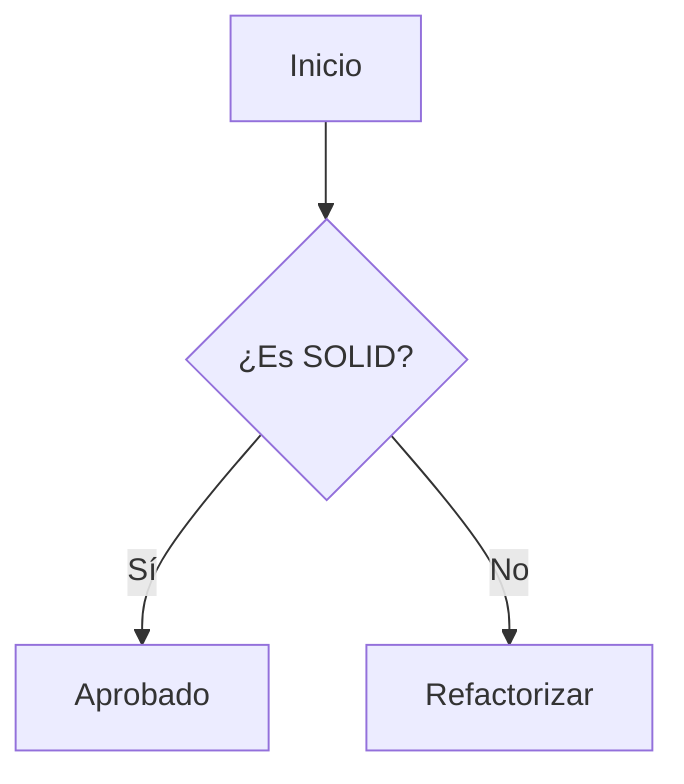

---
tags:
- markdown
- documentation
- tutorial
- obsidian
source: ia
created: 20-01-2026
updated: 2026-02-09 02:05:06.663234
version: '1.0'
type: note
---
Markdown es un lenguaje de marcado ligero que permite aplicar formato a un texto plano de manera sencilla y legible. Es el estándar de oro para documentación técnica y toma de notas en **Obsidian**.

---

## 1. Títulos (Headings)
Se definen mediante el uso de hashtags `#`. El número de hashtags indica el nivel de jerarquía.
* `# H1` - Título principal
* `## H2` - Secciones
* `### H3` - Subsecciones
## 2. Énfasis de Texto
Para modificar el estilo visual de las palabras:
* **Negrita**: `**texto**` o `__texto__`
* *Cursiva*: `*texto*` o `_texto_`
* ~~Tachado~~: `~~texto~~`
* ==Resaltado==: `==texto==` (Específico de Obsidian)

## 3. Listas y Tareas
Organización de información secuencial o por puntos.
### Listas Desordenadas
* Punto A: `* item` o `- item`
* Punto B: `* item`
### Listas Ordenadas
1. Primero: `1. item`
2. Segundo: `2. item`
### Checkboxes (Tareas)
- [ ] Tarea pendiente: `- [ ]`
- [x] Tarea completada: `- [x]`
## 4. Enlaces y Multimedia
Markdown permite integrar recursos externos e internos.
* **Enlace Externo**: `[Texto](URL)`
* **Imagen**: ``
* **WikiLinks**: `[[Nombre de Nota]]` (Estándar de Obsidian para conexión de ideas).
## 5. Bloques de Código

Indispensables para perfiles técnicos y desarrollo.

### Inline Code

Se usa para mencionar variables o comandos cortos: `` `sudo apt update` ``.

### Bloques de Código (Fenced)

Se definen con tres backticks (```) y el lenguaje para el **Type Hinting**.

```python
def saludar(nombre: str) -> None:
    """Función de ejemplo con Type Hinting."""
    print(f"Hola, {nombre}")
```
## 6. Tablas (Ampliación)
Las tablas permiten estructurar datos de forma comparativa. Se utilizan tuberías `|` para las columnas y guiones `-` para separar la cabecera del cuerpo.

| Característica       | Sintaxis |          Resultado |
| :------------------- | :------: | -----------------: |
| Alineación Izquierda |  `:---`  |     Texto alineado |
| Alineación Central   | `:---:`  |     Texto centrado |
| Alineación Derecha   |  `---:`  | Texto a la derecha |

## 7. Citas y Bloques de Texto
Ideales para resaltar fragmentos de otros autores o notas importantes.

> **Nota de Arquitectura**: Siempre prioriza la composición sobre la herencia para mantener un sistema desacoplado y escalable.
> — *Directiva de Ingeniería Senior*

## 8. Separadores Horizontales
Se utilizan para dividir secciones temáticas dentro de una misma nota. Se logran con tres o más guiones, asteriscos o guiones bajos.

`---` o `***`

---

## 9. Notas al Pie (Footnotes)
Permiten añadir referencias o aclaraciones al final del documento sin interrumpir el flujo de lectura.

- Declaración: `Este concepto es fundamental[^1].`
- Definición (al final del archivo): `[^1]: Aquí va la explicación detallada.`

## 10. Mermaid (Diagramas en Obsidian)
Obsidian permite renderizar diagramas de flujo, Gantt o de secuencia directamente en el bloque de código usando la sintaxis de Mermaid.

```#mermaid
graph TD;
    A[Inicio] --> B{¿Es SOLID?};
    B -- Sí --> C[Aprobado];
    B -- No --> D[Refactorizar]; 
```

 ------------------------------- ⬇⬇⬇

