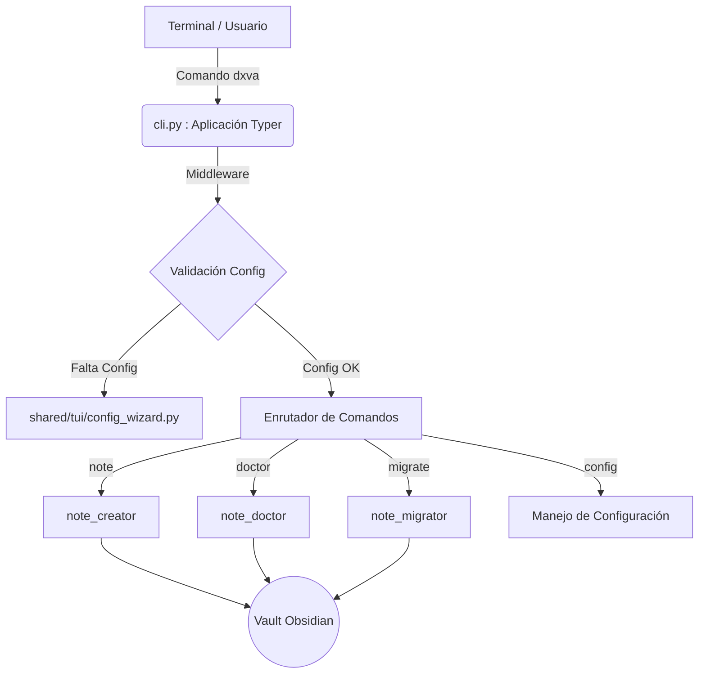
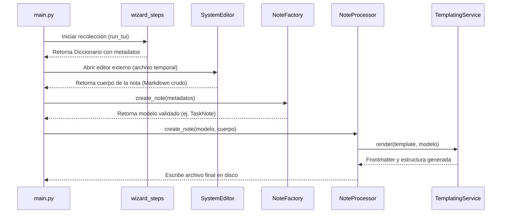
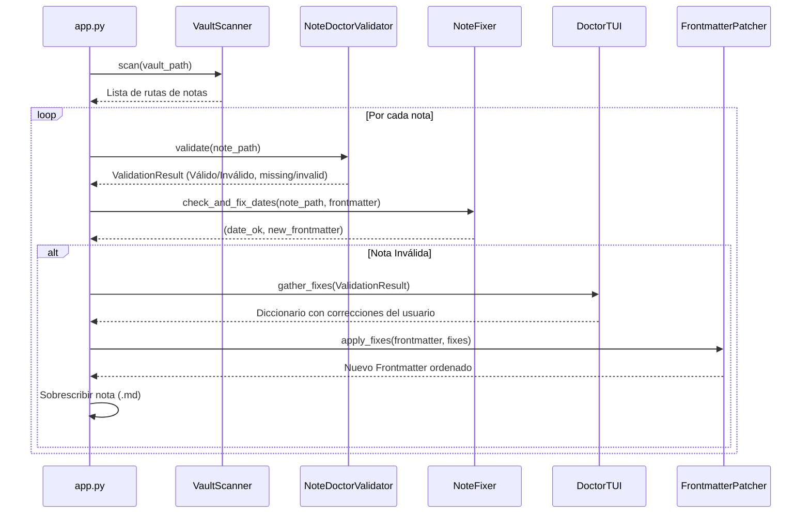
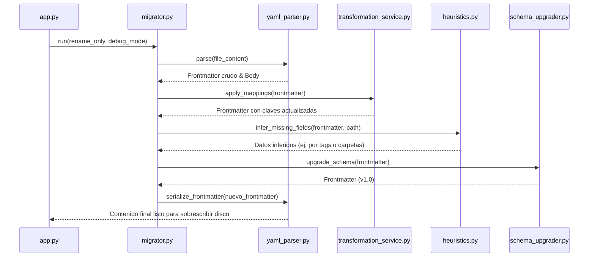
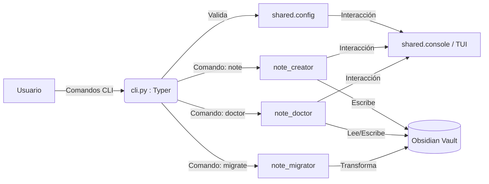

# Dx Vault Atlas: Arquitectura Base e Índice Global

> [!INFO] Resumen
> Documentación técnica de `dx-vault-atlas`, una herramienta CLI orientada a la gestión y automatización de baúles de Obsidian mediante metodologías como Zettelkasten y PARA.

## Índice Global de la Documentación
1. **Fase 1:** Visión General, Raíz y CLI Principal (Actual)
2. **Fase 2:** Módulo Compartido (`shared/`)
3. **Fase 3:** Servicio `note_creator`
4. **Fase 4:** Servicio `note_doctor`
5. **Fase 5:** Servicio `note_migrator`
6. **Fase 6:** Scripts de Utilidad (`scripts/`)
7. **Fase 7:** Suite de Pruebas (`tests/`)

## Árbol de Directorios Estructural (Raíz)

```text
dx-vault-atlas/
├── src/
│   └── dx_vault_atlas/
│       ├── cli.py             # Punto de entrada principal (Typer)
│       ├── services/          # Servicios core (Creator, Doctor, Migrator)
│       └── shared/            # Infraestructura transversal (Config, UI, Utils)
├── scripts/                   # Utilidades de desarrollo y reproducción de bugs
├── tests/                     # Suite de pruebas automatizadas
├── pyproject.toml             # Configuración de dependencias (uv/hatchling)
├── uv.lock                    # Lockfile de dependencias exactas
└── README.md                  # Documentación de entrada y comandos básicos
```

## Arquitectura General (CLI y Enrutamiento)



# Análisis de Archivos Core (Fase 1)

### Archivos de Configuración del Root

#### `pyproject.toml`
- **Rol:** Define la identidad del proyecto, el sistema de construcción (`hatchling`), las dependencias principales y la configuración unificada de las herramientas de desarrollo.
- **Procesamiento:** Define `typer`, `rich`, `textual`, `questionary` para la capa de presentación (CLI/TUI) y `pydantic` para la validación estricta de datos.
- **Salidas (Entry Points):** Genera el ejecutable de terminal `dxva` que apunta a `dx_vault_atlas.cli:app`.
- **Integraciones:** Contiene reglas estrictas de linting para `ruff` y tipado para `mypy`, además de marcadores personalizados para `pytest`.

### Módulo Principal

#### `src/dx_vault_atlas/cli.py`
- **Rol:** Es el orquestador y punto de entrada principal. Recibe la intención del usuario y la delega al servicio correspondiente.
- **Entradas:** Argumentos y flags de terminal interceptados mediante `typer`.
- **Procesamiento:**
  - **Bootstrap Callback:** Ejecuta una verificación antes de cualquier comando para asegurar que el entorno esté configurado (mediante `ensure_config_exists()`). Si no lo está, fuerza al usuario a pasar por el wizard de configuración inicial.
  - **Manejo de Errores (Main Catch):** Envuelve la ejecución en un bloque `try/except` global. Captura excepciones no manejadas, evita colapsos del stack trace en pantalla y muestra un panel estético con la ruta hacia el archivo log (Skill 06: Error Lifecycle).
- **Salidas / Enrutamiento (Subcomandos):**
  - Comando `config`: Registra subcomandos delegados a los visores y editores de configuración (`show`, `edit`, `reset`).
  - Comando `note`: Llama a la lógica principal del creador interactivo de notas.
  - Comando `migrate`: Procesa flags como `--rename-only` y `--debug-mode` y delega a `note_migrator.app`.
  - Comando `doctor`: Procesa flags como `--fix-date` y delega al escáner de `note_doctor.app`.

> [!WARNING] Aislamiento de Dependencias
> El archivo `cli.py` utiliza "Lazy Imports" (importaciones dentro de las funciones de comando). Esto evita errores de dependencias circulares durante el arranque de la aplicación y mejora el tiempo de respuesta del CLI, cargando en memoria únicamente los módulos del servicio invocado.

# Fase 2: Módulo Compartido (`shared/`)

> [!INFO] Resumen de la Capa Compartida
> El directorio `shared/` contiene la infraestructura transversal de la aplicación. Centraliza la configuración, el registro de eventos (logging), la interfaz de usuario por consola y las utilidades core que son consumidas de forma agnóstica por los diferentes servicios (Creator, Doctor, Migrator).

## Árbol de Directorios (`shared/`)

```text
src/dx_vault_atlas/shared/
├── config.py           # Gestor unificado de configuración
├── console.py          # Utilidades UI (Rich + Questionary)
├── logger.py           # Sistema centralizado de logs
├── paths.py            # Resolución de rutas absolutas internas
├── core/               # Lógica de negocio compartida
│   ├── bootstrap.py    # Rutinas de inicialización
│   ├── scanner.py      # Escáner de sistema de archivos
│   └── system_editor.py# Integración con editores externos
└── tui/                # Componentes Text User Interface (Textual/Rich)
    ├── config_wizard.py# Asistente de primera configuración
    └── ...             # Otros widgets y apps de Textual
```

## Análisis de Archivos Core y Utilidades

### `config.py` (y `config1.py`)
- **Rol:** Carga, valida y persiste la configuración global del usuario en el sistema (estándar XDG: `~/.config/dx-vault-atlas/config.json`).
- **Procesamiento:** Utiliza `pydantic.BaseModel` (y `pydantic-settings` en versiones previas/alternativas) para la validación estricta. Intercepta las rutas ingresadas (`vault_path`, `vault_inbox`) y verifica mediante validadores (`@field_validator`) que los directorios existan y sean válidos antes de instanciar la configuración.
- **Salidas:** Provee la clase `GlobalConfig` y un Singleton `ConfigManager` (mediante `get_config_manager()`) que expone los métodos `.load()`, `.save()` y `.delete()`.

### `logger.py`
- **Rol:** Estandariza la observabilidad ("Zero Print policy for internals") guardando los logs de los procesos en `~/.local/state/dx-vault-atlas/app.log` (o equivalente del SO).
- **Procesamiento:** Implementa `logging.FileHandler` con un formato estructurado separado por pipes (`|`) para fácil parseo. Si falla la creación del directorio, realiza un "Fail Fast" saliendo con `sys.exit(1)`.
- **Salidas:** Exporta la instancia Singleton `logger` y una función `enable_debug_logging()` para volcar la salida a `stderr` si el CLI se ejecuta en modo debug.

### `console.py`
- **Rol:** Actúa como envoltorio estandarizado para interacciones CLI síncronas usando `rich` (paneles, colores) y `questionary` (prompts interactivos).
- **Entradas:** Cadenas de texto para preguntas y listas de enumeradores (`Enum`).
- **Procesamiento:** Mapea excepciones nativas o inputs (`q`, `Ctrl+C`) hacia errores controlados del dominio como `UserQuitError`.
- **Salidas:** Retorna cadenas de texto saneadas, booleanos para confirmaciones o miembros `Enum` seleccionados (`choose_enum`).

### `paths.py`
- **Rol:** Contiene constantes absolutas calculadas en tiempo de ejecución (`PACKAGE_ROOT`, `TEMPLATES_DIR`) y funciones de verificación (`ensure_templates_exist()`) para evitar errores de rutas relativas sin importar desde dónde se invoque el comando.

## Análisis del Submódulo `core/`

### `core/scanner.py` (`VaultScanner`)
- **Rol:** Encuentra archivos Markdown dentro del baúl de Obsidian, filtrando directorios internos o basura.
- **Entradas:** Ruta raíz del baúl (`Path`) y un set opcional de exclusiones.
- **Procesamiento:** Usa `rglob("*.md")` y filtra iterativamente cualquier ruta que contenga partes excluidas (como `.obsidian`, `.trash`, `.git`, o `templates`).
- **Salidas:** Un `Generator[Path, None, None]` eficiente en memoria con las rutas a los archivos válidos.

### `core/system_editor.py` (`SystemEditor`)
- **Rol:** Lanza el editor de texto preferido del usuario (ej. VS Code, Vim, Notepad) y suspende la ejecución hasta que se cierre.
- **Procesamiento:** Lee la variable de entorno `DXVA_EDITOR`, el config del sistema `EDITOR`, o usa fallbacks según el sistema operativo (`nt` vs `posix`). Usa `shlex.split` para procesar comandos complejos y `subprocess.check_call`.

### `core/bootstrap.py`
- **Rol:** Orquesta el arranque. Verifica si existe el archivo de configuración usando `ConfigManager`. Si no existe, invoca la interfaz gráfica de `config_wizard.py`.

## Análisis del Submódulo `tui/`

### `tui/config_wizard.py`
- **Rol:** Asistente interactivo de "Primer Uso" ("First-run configuration wizard").
- **Procesamiento:** Usa `rich.prompt.Prompt` para solicitar secuencialmente: 1) Ruta del baúl, 2) Ruta del Inbox, y 3) Comando del editor. Usa la función `_validate_directory` para forzar al usuario a ingresar rutas reales.
- **Salidas:** Un objeto `GlobalConfig` que es devuelto a `bootstrap.py` para su persistencia.

# Fase 3: Servicio `note_creator`

> [!INFO] Resumen
> El servicio `note_creator` se encarga de todo el ciclo de vida para la creación de nuevas notas en el baúl. Utiliza asistentes interactivos de terminal (TUI) para recolectar metadatos, abre el editor del sistema para el cuerpo de la nota, valida la estructura mediante modelos de Pydantic y finalmente renderiza plantillas Markdown usando Jinja2.

## Árbol de Directorios Estructural (`note_creator/`)

```text
src/dx_vault_atlas/services/note_creator/
├── main.py                # Punto de entrada y bucle principal
├── app.py                 # Orquestador alternativo/legado de la app
├── defaults.py            # Valores por defecto (Tags, Versión de Esquema, etc.)
├── core/                  # Lógica de negocio dura
│   ├── factory.py         # Instanciador dinámico de modelos Pydantic
│   └── processor.py       # Renderizado de plantillas y escritura a disco
├── models/                # Modelos de datos y validación
│   ├── enums.py           # Enumeradores (Status, Source, Priority, etc.)
│   └── note.py            # Clases Pydantic (BaseNote, TaskNote, ProjectNote...)
├── services/              # Integraciones externas
│   ├── templating.py      # Motor Jinja2 para las plantillas Markdown
│   └── note_creator.py    # Servicio auxiliar de construcción
├── tui/                   # Capa de presentación (Consola)
│   └── wizard_steps.py    # Pasos dinámicos del asistente interactivo
├── utils/                 # Herramientas de soporte
│   └── title_normalizer.py# Saneador de títulos a nombres de archivo seguros
└── templates/             # (Carpeta referenciada) Plantillas base .md
```

## Flujo de Ejecución Core



## Análisis de Archivos y Responsabilidades

### 1. Controladores y Orquestadores
- **`main.py`:** Es el bucle de ejecución principal. Orquesta la recolección de datos (`run_tui`), invoca a `SystemEditor` (bloqueando el hilo hasta que el usuario cierra el editor), usa `TitleNormalizer` para generar una ruta segura en el `vault_inbox`, pasa los datos a `NoteFactory` y finalmente pide a `NoteProcessor` que escriba el archivo.
- **`app.py`:** Contiene la clase `NoteCreatorApp`. Actúa como un orquestador que inyecta dependencias (como `NoteProcessor` y los `settings`) y encapsula la lógica del asistente. Mapea `NoteTemplate` a sus respectivas clases usando `MODEL_MAP`.

### 2. Modelos de Dominio (`models/`)
- **`models/note.py`:** Define la jerarquía de datos utilizando Pydantic. Todas las notas heredan de `BaseNote`. A través de herencia, se añaden capas de complejidad:
  - `BaseNote` → (title, aliases, tags, created, type)
  - `RankedNote` → añade (source, priority)
  - `WorkflowNote` → añade (status, area)
  - `ProjectNote` / `TaskNote` → añaden campos de fechas y resultados.
- **`models/enums.py`:** Define estructuras estrictas (`IntEnum` y `StrEnum`) para acotar las opciones del usuario. Ejemplos: `Priority`, `NoteStatus`, `NoteSource`.

### 3. Lógica Core (`core/`)
- **`core/factory.py` (`NoteFactory`):** Recibe el diccionario "crudo" del TUI y, basándose en el tipo de plantilla (`template`), decide qué modelo Pydantic instanciar (ej. Si el template es `TASK`, instancia `TaskNote`). Parsea y estructura campos base como los `aliases` y preasigna los `tags` por defecto.
- **`core/processor.py` (`NoteProcessor`):** Actúa como la última milla. Recibe el modelo de datos validado (`BaseNote`), llama al motor de plantillas para generar el contenido base, le concatena el `body_content` proveniente del editor externo y usa `pathlib.Path.write_text` para guardar físicamente el archivo `.md`. Lanza un `FileExistsError` como medida de seguridad.

### 4. Servicios de Plantillas (`services/`)
- **`services/templating.py` (`TemplatingService`):** Envuelve el motor `Jinja2`. Configura el entorno cargando el directorio `TEMPLATES_DIR`. Extrae la información del modelo Pydantic usando `.model_dump(by_alias=True)` y la inyecta en el archivo de plantilla `.md` correspondiente.

### 5. TUI y Utilidades (`tui/` y `utils/`)
- **`tui/wizard_steps.py`:** Genera un sistema de preguntas dinámico. Utiliza un mapa (`_STEPS_MAP`) donde, según el tipo de nota elegida, lanza más o menos preguntas. (Ej: Un MOC no pide Área ni Prioridad, pero un Proyecto sí).
- **`utils/title_normalizer.py` (`TitleNormalizer`):** Sanitiza cualquier string usando expresiones regulares y `unicodedata` (NFKD) para eliminar acentos y caracteres raros. Genera siempre un prefijo Zettelkasten seguro: `YYYYMMDDHHMMSS_titulo_saneado`.
- **`defaults.py`:** Archivo de configuración estático que almacena constantes puras (`SCHEMA_VERSION`, tags predeterminados, e índices de selección default de la UI).

# Fase 4: Servicio `note_doctor`

> [!INFO] Resumen
> El servicio `note_doctor` es una herramienta de mantenimiento continuo para el baúl. Funciona como un linter/reparador que escanea todas las notas buscando problemas estructurales (metadatos faltantes, enumeradores inválidos, fechas corruptas) y ofrece un flujo interactivo (TUI) o automático (solo fechas) para parchear y sanear el frontmatter.

## Árbol de Directorios Estructural (`note_doctor/`)

```text
src/dx_vault_atlas/services/note_doctor/
├── main.py                # Punto de entrada y bucle principal
├── app.py                 # Orquestador del servicio Doctor
├── validator.py           # Validador de esquemas (Pydantic + Enums)
├── tui.py                 # Interfaz de usuario interactiva para reparaciones
└── core/                  # Lógica de curación y parcheo
    ├── date_resolver.py   # Heurística para recuperar fechas de creación reales
    ├── fixer.py           # Servicio de dominio para arreglar notas
    └── patcher.py         # Mutador seguro de diccionarios YAML
```

## Flujo de Ejecución Core



## Análisis de Archivos y Responsabilidades

### 1. Orquestación
- **`app.py` (`DoctorApp`):** Actúa como el controlador principal.
  - **Entradas:** Dependencias inyectadas (`AppSettings`) y flags del CLI (`--fix-date`, `--debug-mode`).
  - **Procesamiento:** Usa `VaultScanner` para iterar sobre todos los `.md`. Llama a `NoteDoctorValidator` para clasificar las notas. Si el flag `--fix-date` está activo, ignora el TUI y solo corrige fechas. Si es un escaneo completo, evalúa los `ValidationResult` y acumula las notas inválidas para procesarlas interactivamente.
  - **Integraciones:** Depende fuertemente de `YamlParserService` (del módulo `note_migrator`) para leer y escribir el frontmatter de forma segura sin romper el cuerpo de la nota.

### 2. Validación (`validator.py`)
- **`NoteDoctorValidator`:** El motor de reglas.
  - **Procesamiento:** 1. Verifica la existencia estricta de campos definidos en `REQUIRED_FIELDS` según el `type` de la nota (ej. `info` exige `source`, `priority`, `status`).
    2. Realiza verificaciones de tipo contra los Enums (ej. intentar instanciar `Priority("alta")` fallará y marcará el campo como inválido).
    3. Verifica la versión del esquema contra `SCHEMA_VERSION` usando la librería `packaging.version`.
    4. Usa los modelos Pydantic de `note_creator` (como `ProjectNote` o `TaskNote`) como última línea de defensa para la validación estricta de tipos.
  - **Salidas:** Un objeto `ValidationResult` rico en contexto, que incluye booleanos (`is_valid`) y listas de campos problemáticos (`missing_fields`, `invalid_fields`).

### 3. Reparación Automática de Fechas (`core/`)
- **`core/date_resolver.py` (`DateResolver`):** Implementa una heurística escalonada para descubrir la fecha de creación real de una nota cuando el frontmatter está corrupto o vacío.
  - *Prioridad 1:* Intenta parsear la fecha directamente desde el nombre del archivo si sigue el estándar Zettelkasten (14 o 12 dígitos iniciales).
  - *Prioridad 2:* Busca claves legadas en el YAML como `date` en lugar de `created`.
  - *Prioridad 3:* Como último recurso, lee los metadatos de creación del sistema de archivos del SO (`stat.st_ctime`).
- **`core/fixer.py` (`NoteFixer`):** Delega en `DateResolver` y compara las fechas resueltas con las actuales. Si difieren, muta el diccionario para inyectar `created` y `updated` correctos.

### 4. Reparación Interactiva (TUI) y Parcheo
- **`tui.py` (`DoctorTUI`):** Evalúa el `ValidationResult` y construye un arreglo dinámico de pasos del TUI (`WizardConfig`).
  - *Lógica Inteligente:* Si el usuario cambia el tipo de nota a `info`, el TUI puede inyectar el campo `status` automáticamente si faltaba, evitando preguntas redundantes. Si un campo clave como `type` está roto, fuerza a re-preguntar todos los campos dependientes (`source`, `priority`, `area`, etc.).
- **`core/patcher.py` (`FrontmatterPatcher`):** Toma las correcciones del TUI y las fusiona con el YAML existente.
  - *Limpieza:* Si el usuario arregló el título, asegura que este se añada automáticamente a la lista de `aliases`.
  - *Formateo:* Asegura que listas separadas por comas se conviertan en verdaderos Arrays de YAML.
  - *Canonical Ordering:* Al finalizar, reordena todas las claves del diccionario basándose en `ORDERED_FIELDS` para que todas las notas del baúl tengan exactamente la misma estructura visual.

# Fase 5: Servicio `note_migrator`

> [!INFO] Resumen
> El servicio `note_migrator` está diseñado para actualizar notas heredadas (legacy) al nuevo esquema unificado del baúl (versión actual). Se encarga de transformar campos antiguos, aplicar heurísticas para inferir metadatos faltantes y actualizar la versión del frontmatter de forma masiva y segura.

## Árbol de Directorios Estructural (`note_migrator/`)

```text
src/dx_vault_atlas/services/note_migrator/
├── main.py                # Punto de entrada
├── app.py                 # Orquestador del servicio Migrator
├── core/                  # Lógica de migración
│   ├── migrator.py        # Motor principal de ejecución
│   ├── transformation_service.py # Renombramiento de campos mapeados
│   ├── schema_upgrader.py # Actualizador de versiones de esquema
│   ├── heuristics.py      # Inferencia contextual de metadatos
│   └── errors.py          # Excepciones personalizadas de dominio
├── models/                # Estructuras de datos
│   ├── migration.py       # Modelos de reporte y tracking
│   └── frontmatter.py     # Modelos base legados vs nuevos
└── services/              # Integraciones técnicas
    ├── yaml_parser.py     # Parser seguro de frontmatter
    └── editor_buffer.py   # Gestión segura de I/O en disco
```

## Flujo de Ejecución Core



## Análisis de Archivos y Responsabilidades

### 1. Orquestación y Core (`core/` y Raíz)
- **`app.py` y `main.py`:** Gestionan la configuración inicial inyectando `AppSettings` para leer los mapeos definidos por el usuario (ej. `field_mappings = {"date": "created"}`). Soportan el procesamiento de flags del CLI como `--rename-only` para ejecutar pasadas de migración parciales sin tocar la versión del esquema.
- **`core/migrator.py` (`Migrator`):** Es el coordinador del pipeline de migración. Itera sobre los archivos Markdown descubiertos por el escáner del baúl, extrae el bloque YAML, lo procesa secuencialmente a través de los sub-servicios y evalúa si hubo cambios ("dirty flag") antes de autorizar la escritura a disco.
- **`core/transformation_service.py`:** Se encarga de la normalización del vocabulario de metadatos. Busca claves obsoletas en el diccionario YAML y transfiere sus valores a las claves modernas, preservando estrictamente el tipo de dato subyacente.
- **`core/heuristics.py`:** Analiza pistas contextuales de la nota cuando faltan campos requeridos. Por ejemplo, puede inferir que una nota es de tipo `project` o `task` basándose en etiquetas heredadas (`#proyecto`), la carpeta en la que reside o metadatos adyacentes.
- **`core/schema_upgrader.py`:** Inyecta o actualiza la clave `version` en el frontmatter (actualizando a `1.0`). Validará si una nota ya cumple con la versión objetivo para omitir su procesamiento y ahorrar carga de I/O.

### 2. Modelos (`models/`)
- **`models/migration.py`:** Define las estructuras para consolidar los resultados. Genera estadísticas al final del proceso indicando cuántos archivos fueron procesados, ignorados o fallaron.
- **`models/frontmatter.py`:** Representaciones Pydantic temporales utilizadas para evaluar las diferencias estructurales entre los esquemas de entrada (antiguos) y los esquemas de salida estandarizados esperados por el resto del sistema.

### 3. Servicios Auxiliares (`services/`)
- **`services/yaml_parser.py`:** Motor crítico encargado de separar limpiamente el bloque `---` YAML del contenido `body` de la nota. Asegura que los saltos de línea y el Markdown original se conserven intactos al momento de re-serializar el archivo tras la migración.
- **`services/editor_buffer.py`:** Actúa como un escudo contra la corrupción de datos. Funciona como un mecanismo intermedio en memoria o transaccional para asegurar que si el script falla o es interrumpido, la nota en disco no quede truncada o destruida.

# Fase 6: Scripts de Utilidad (`scripts/`)

> [!INFO] Resumen
> El directorio `scripts/` actúa como una caja de arena (sandbox) para el desarrollo, depuración y verificación del comportamiento de los diferentes servicios de la aplicación. No forma parte del código de producción (core distribuido), pero es vital para aislar bugs, generar datos de prueba y validar flujos interactivos de forma controlada.

## Árbol de Archivos (`scripts/`)

```text
dx-vault-atlas/scripts/
├── create_test_notes_manually.py # Generador de baúl temporal
├── fix_test_notes.py             # Utilidad de manipulación de estado
├── reproduce_cli_flow.py         # Simulador de ciclo de vida CLI
├── reproduce_ref_info.py         # Reproductor de casos de borde de modelos
├── reproduce_version_issue.py    # Aislador de errores de esquema (versioning)
├── verify_debug.py               # Probador de logs a stderr
├── verify_doctor_autofill.py     # Validador de heurísticas de TUI
└── verify_doctor_debug.py        # Validador del modo desatendido del Doctor
```

## Categorización y Responsabilidades

### 1. Generadores de Entorno y Datos Mock
- **`create_test_notes_manually.py`**
  - **Rol:** Prepara un entorno de pruebas sucio instanciando notas `.md` temporales en un directorio de pruebas (ej. `/tmp/vault`).
  - **Procesamiento:** Genera programáticamente archivos con *frontmatters* intencionalmente corruptos, incompletos (ej. sin `type` o `title`) o desactualizados para que los servicios como `note_doctor` o `note_migrator` tengan material anómalo sobre el cual operar.
- **`fix_test_notes.py`**
  - **Rol:** Utilidad rápida para aplicar parches o revertir el estado de los datos de prueba masivamente, útil para limpiar o reiniciar el escenario entre ejecuciones manuales.

### 2. Aisladores de Bugs (Reproducers)
- **Familia `reproduce_*.py`**
  - **Rol:** Scripts hiper-enfocados que extraen un flujo específico de la aplicación para aislar un error (bug) reportado, ignorando el resto del pipeline.
  - **Ejemplos y Lógica:**
    - `reproduce_version_issue.py`: Simula el escenario exacto donde una nota es completamente válida según Pydantic, pero su campo `version` es inferior a `SCHEMA_VERSION` (ej. `0.9` en vez de `1.0`), forzando al sistema a probar si el orquestador lo marca adecuadamente como "desactualizado".
    - `reproduce_ref_info.py`: Evalúa el comportamiento estricto de los modelos `RefNote` e `InfoNote`, probando cómo Pydantic reacciona a la ausencia de campos opcionales o predeterminados (como `status`).
    - `reproduce_cli_flow.py`: Dispara el enrutamiento de `Typer` de forma programática para depurar problemas de captura global de excepciones ("Main Catch", Skill 06) sin requerir comandos manuales en la consola.

### 3. Verificadores de Comportamiento (Sanity Checks)
- **Familia `verify_*.py`**
  - **Rol:** Actúan como pruebas de integración interactivas (manuales) o de humo (*smoke tests*) para certificar que la UI, los *prompts* y los *logs* se comportan correctamente bajo condiciones específicas.
  - **Ejemplos y Lógica:**
    - `verify_doctor_autofill.py`: Valida específicamente la "lógica inteligente" dentro de `DoctorTUI`. Confirma que si un usuario repara una nota asignándole el tipo `info`, el sistema inyecta automáticamente el `status: "to read"` en el diccionario de arreglos, omitiendo la pantalla de pregunta al usuario.
    - `verify_doctor_debug.py` y `verify_debug.py`: Confirman que el flag `--debug-mode` deshabilita correctamente las llamadas a `questionary` y `rich`, redirigiendo el flujo de ejecución hacia respuestas automáticas y volcando la traza de ejecución pura al `stderr` vía el módulo centralizado de `logger`.

# Fase 7: Suite de Pruebas (`tests/`)

> [!INFO] Resumen
> El directorio `tests/` contiene toda la batería de pruebas automatizadas del proyecto. Utiliza `pytest` como framework principal, organizando las pruebas desde validaciones unitarias puras hasta simulaciones de interacción con la interfaz de consola (TUI).

## Árbol de Archivos (`tests/`)

```text
dx-vault-atlas/tests/
├── conftest.py                   # Configuración global y Fixtures de pytest
├── test_title_normalizer.py      # Pruebas unitarias de sanitización de cadenas
├── test_validator.py             # Pruebas unitarias del motor de reglas del Doctor
├── test_processor.py             # Pruebas de renderizado Jinja y escritura
├── test_note_creator_main.py     # Pruebas de integración del orquestador Creator
├── test_note_creator_tui.py      # Pruebas de flujos interactivos (Creator)
├── test_tui_wizard.py            # Pruebas del motor genérico de Wizards
└── test_tui_widgets.py           # Pruebas de componentes UI aislados
```

## Arquitectura de Testing y Responsabilidades

### 1. Configuración Base (`conftest.py`)
- **Rol:** Es el corazón del entorno de pruebas. Provee *fixtures* reutilizables que son inyectados automáticamente por `pytest` en las funciones de prueba.
- **Responsabilidades comunes:**
  - Crear directorios temporales (`tmp_path`) que simulan un baúl de Obsidian aislado para que los tests no modifiquen los archivos reales del usuario.
  - Proveer instancias *mockeadas* de `AppSettings` (configuración).
  - Configurar interceptores para `sys.stdout` o `sys.stderr` y suprimir salidas ruidosas durante la ejecución de los tests.

### 2. Pruebas Unitarias Core (Lógica de Negocio)
- **`test_title_normalizer.py`:** Verifica que caracteres especiales, acentos (ej. "Árbol") y espacios se conviertan estrictamente en un formato alfanumérico seguro con guiones bajos, validando la inyección de la marca de tiempo `YYYYMMDDHHMMSS`.
- **`test_validator.py`:** Inyecta diccionarios YAML malformados (sin título, con fechas futuras, o enums inválidos como `priority: 99`) en el `NoteDoctorValidator` para asegurar que el sistema genere el `ValidationResult` correcto y marque exactamente qué campos fallaron.
- **`test_processor.py`:** Comprueba la integración con Jinja2. Asegura que al pasar un modelo Pydantic validado, el archivo `.md` resultante se escriba en el disco simulado conteniendo el frontmatter exacto y el contenido del cuerpo esperado.

### 3. Pruebas de UI e Integración (Capa de Presentación)
- **Familia `test_tui_*.py` y `test_note_creator_tui.py`:**
  - **Rol:** Validar que los asistentes interactivos respondan correctamente a las entradas del usuario.
  - **Mecanismo:** Dado que la aplicación usa `rich` y `questionary` (o `textual`), estas pruebas utilizan *mocks* o frameworks de automatización de terminal (como `unittest.mock.patch`) para simular pulsaciones de teclas (`Enter`, flechas, `q` para salir) y verificar que los diccionarios de datos devueltos contengan la información elegida.
- **`test_note_creator_main.py`:** Prueba el flujo de vida completo del Creador de Notas de principio a fin, asegurando que el TUI recolecte los datos, el *factory* genere el modelo, y el procesador guarde el archivo, validando el enrutamiento y el manejo de excepciones (Main Catch).

## Archivos de Entorno y Cierre

> [!INFO] Conclusión
> Con esta nota se finaliza el mapeo completo del proyecto `dx-vault-atlas`. A continuación se documentan los archivos de infraestructura del repositorio que sostienen la ejecución y control de versiones.

## Archivos de Control de Repositorio (Raíz)

### `.env.example`
- **Rol:** Plantilla de declaración para las variables de entorno.
- **Procesamiento:** Provee la estructura base para que el usuario cree su propio archivo `.env` local. Estas variables son consumidas por el `GlobalConfig` (basado en `pydantic-settings`) para sobrescribir configuraciones por defecto (ej. `DX_VAULT_PATH`).

### `.gitignore`
- **Rol:** Mantiene la higiene del repositorio.
- **Procesamiento:** Excluye del control de versiones directorios generados dinámicamente o específicos del sistema, tales como dependencias virtuales, volcados de logs temporales, y cachés de Python (`__pycache__/`, `.pytest_cache/`).

### `.gitmodules`
- **Rol:** Gestión de dependencias a nivel de repositorio.
- **Procesamiento:** Rastrea y vincula submódulos de Git, lo que permite integrar repositorios independientes (por ejemplo, librerías compartidas de plantillas o utilidades) dentro del árbol de `dx-vault-atlas`.

### `LICENSE`
- **Rol:** Define los términos legales de uso y distribución de la herramienta. Basado en el `pyproject.toml`, corresponde a la licencia MIT, permitiendo libre uso, modificación y distribución.

## Resumen de Interacción Global (Big Picture)


